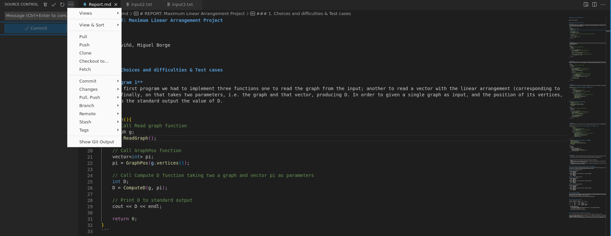

# Edit with VS Code

Using GitHub with Visual Studio Code lets you share your source code and collaborate with others right within your editor. There are many ways to interact with GitHub, for example, via their website at [https://github.com](https://github.com) or the [Git](https://git-scm.com) command-line interface (CLI), but in VS Code, the rich GitHub integration is provided by the [GitHub Pull Requests and Issues](https://marketplace.visualstudio.com/items?itemName=GitHub.vscode-pull-request-github) extension.

### Getting started with GitHub Pull Requests and Issues 

Once you've installed the [GitHub Pull Requests and Issues](https://marketplace.visualstudio.com/items?itemName=GitHub.vscode-pull-request-github) extension, you'll need to sign in. Follow the prompts to authenticate with GitHub in the browser and return to VS Code.

If you are not redirected to VS Code, you can add your authorization token manually. In the browser window, you will receive your authorization token. Copy the token, and switch back to VS Code. Select **Signing in to github.com** in the Status bar, paste the token, and hit Enter

### Setting up a repository 

#### Cloning a repository 

You can search for and clone a repository from GitHub using the **Git: Clone** command in the Command Palette (Ctrl+Shift+P) or by using the **Clone Repository** button in the Source Control view (available when you have no folder open).

From the GitHub repository dropdown you can filter and pick the repository you want to clone locally.

<figure><figcaption></figcaption></figure>

### Commit changes

Once you have cloned the desired repository locally, you can use vscode as the editor to perform the changes you need.

In order to commit the changes you enter a description and click the commit button in the source control tab.

<figure><figcaption></figcaption></figure>

Visual Studio Code Source Control allows you to perform all the Git operations you need in simple way

<figure><figcaption></figcaption></figure>

