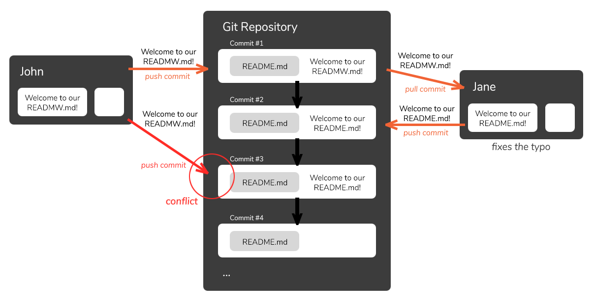

# Merge

A commonly used branching workflow in Git is to create a new code branch for each new feature, bug fix, or enhancement. These are called _**Feature Branches**_. Each branch compartmentalizes the commits related to a particular feature. Once the new feature is complete – i.e. a set of changes has been committed on the feature branch – it is ready to be merged back into the master branch (or other main code line branch depending on the workflow in use).

If you're merging a new feature into the main branch, you first want to switch to the main branch and then merge into it:

<pre class="language-bash"><code class="lang-bash"><strong>git checkout -b new-branch
</strong><strong>
</strong><strong># ...develop some code...
</strong>
git add –A
git commit –m "Some commit message"
git checkout main
Switched to branch 'main'
git merge new-branch</code></pre>

If all goes well then our job is done. The new feature commits now appear in the main branch. However, it is possible that Git won't be able to complete the merge due to a conflict change in the source branch. This is called a _**merge conflict**_.

### Solving Merge Conflicts

_Merge Conflicts_ arise when multiple agents modify the same part of a file and push their changes to a remote branch. When you attempt to merge, pull from or push to these branches - there's a conflict, and Git isn't sure which set of changes to accept and which to reject, since there's no objective measure of which change is _right_.

<figure><figcaption></figcaption></figure>

```bash
git merge feature_john
Auto-merging README.md
CONFLICT (content): Merge conflict in README.md
Automatic merge failed; fix conflicts and then commit the result.
```

### Find Merge Conflict Source <a href="#findmergeconflictsource" id="findmergeconflictsource"></a>

The first step you need to take is find out _why_ there's a Merge Conflict in the first place. When in the _MERGING_ phase, as we are, Git will annotate the file that's causing the conflict. If we open the `README.md` file on John's local machine, we'll see:

```
<<<<<<< HEAD
Welcome to our README.md!
=======
'Welcome to our READMW.md!' 
New line!
>>>>>>> feature_john
```

The `<<<<<<<` denotes the cause of the conflict and the current reference follows it (`HEAD`). This is the change from `main`. Then, we've got the `=======` line (just a separator) before John's set of changes.

Finally, the `>>>>>>>` denotes that that's the end of the conflict, with the branch name we're trying to merge into the top side of `=======`.

### Solve Merge Conflict with _git merge --abort_ <a href="#solvemergeconflictwithgitmergeabort" id="solvemergeconflictwithgitmergeabort"></a>

A valid way to solve the conflict is to abort from it - and stop the _MERGING_ phase. This is typically done when the solution isn't to fix a single line - and when large changes need to be made. This usually necessitates a plan with a team member as well.

> If we abort the merge, the added conflict lines will be removed and we'll have John's `README.md` file once again.

While we're still in the merging phase, let's abort the merge altogether:

```bash
git merge --abort
```

This simply aborts the merge and your file is returned to its state before you've encountered the conflict:

```
'Welcome to our READMW.md!' 
New line!
```

If you're using Git's Command-Line Editor (or other shells that support the feature), you'll also be able to see which phase you're in:

```bash
(main)
git merge feature_john
Auto-merging README.md
CONFLICT (content): Merge conflict in README.md
Automatic merge failed; fix conflicts and then commit the result.
(main|MERGING)
git merge --abort
(main)
$
```

Now, with your file out of harm's way - phone your colleague and discuss your next steps. Alternatively, if you accept their changes, you can _continue_ with the merge.

### Solve Merge Conflict with _git merge --continue_ <a href="#solvemergeconflictwithgitmergecontinue" id="solvemergeconflictwithgitmergecontinue"></a>

You can _continue_ the merge with a conflict, but Git won't overwrite the files automatically. If you try merging, encounter a conflict, and try to `$ git merge --continue`, you'll face another error:

```bash
git merge feature_john
Auto-merging README.md
CONFLICT (content): Merge conflict in README.md
Automatic merge failed; fix conflicts and then commit the result.

git merge --continue
error: Committing is not possible because you have unmerged files.
hint: Fix them up in the work tree, and then use 'git add/rm <file>'
hint: as appropriate to mark resolution and make a commit.
fatal: Exiting because of an unresolved conflict.
U       README.md
```

If it _were_ possible to continue, Git would've continued already. You're still in the _MERGING_ phase, so you can change your `README.md` to conform to `main`'s version of it, mark the resolution by adding or removing the file again, and _then_ run the `$ git merge --continue` command.

Let's fix the file first. In our case, since the _"Welcome..."_ line was causing an issue, but the _"New line!"_ wasn't - we can leave the new line in - John's new feature - and fix the typo that's in conflict:

```
Welcome to our README.md!
New line!
```

Now, we `add` the file once again and run the `$ git merge --continue` command:

```bash
# Fix the file...
git add README.md

git merge --continue
[main fea8fbb] Merge branch 'feature_john'
```

You've accepted the changes from `main` and adapted your local file to reflect it, and adding it back.

### Solve Merge Conflict By Forcing Local Changes to Remote <a href="#solvemergeconflictbyforcinglocalchangestoremote" id="solvemergeconflictbyforcinglocalchangestoremote"></a>

Instead of aborting, or yielding to changes - if you're certain that the changes made in your working directory are certainly the ones to keep, you can keep the local changes instead of adapting to the remote ones.

When a Merge Conflict occurs, you can `$ git checkout` the file from `feature_john`, and then add it to the `main` branch.

When updating - you can _keep_ the changes made on a different branch and apply it to this branch. On the `main` branch, into which we wish to merge `feature_john`, let's update the `README.md` file to contain the changes from the `feature_john` branch.

In the context of `main`, these changes are referred to as **theirs**, while the changes on `main` are referred to as **ours**. If you wish to keep changes from `main`, switch the `--theirs` flag with `--ours`:

```bash
git checkout --theirs README.md
Updated 1 path from the index
git add README.md

git commit -m "Accepting changes from feature_john"
[main 5541f29] Accepting changes from feature_john
```

Now, you can merge the rest of the changes that are not in conflict cleanly, since we've only created a roundabout merge for the one file that caused a conflict this way.
